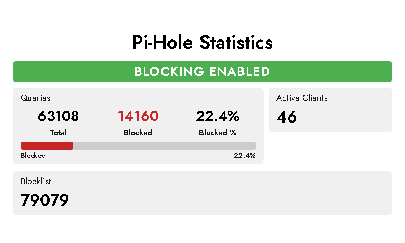
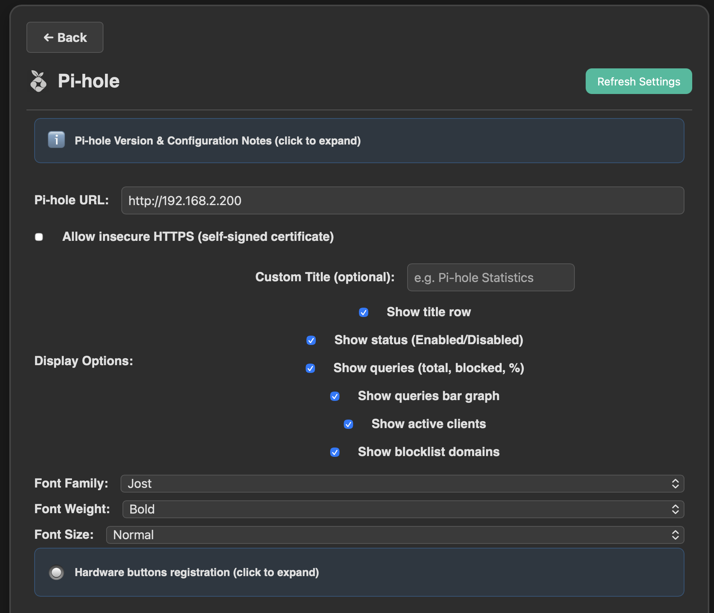

# InkyPi-Plugin-pihole



*InkyPi-Plugin-pihole* is a plugin for [InkyPi](https://github.com/fatihak/InkyPi) that shows Pi-hole statistics on an e-ink display: blocking status, query counts, active clients, and blocklist size in a clear, readable layout.

**What it does:**

- **Status** — Shows whether DNS blocking is **blocking enabled** or **blocking disabled** with a coloured badge.
- **Queries** — Displays total queries today, blocked count, and blocked percentage. Optional bar graph for blocked percentage.
- **Queries forwarded/cached** — Optionally shows forwarded and cached query counts (between Queries and Active Clients).
- **Active clients** — Number of unique clients seen today.
- **Top 5 clients** — Optionally shows the top 5 clients by query count (when the API provides this data; otherwise displays "not available").
- **24h queries chart** — Bar chart of hourly queries over the last 24 hours with green (allowed) and red (blocked) segments. Can be disabled in settings.
- **Blocklist** — Number of domains in the blocklist (gravity).

The plugin uses the **Pi-hole v6+ REST API** (`/api/*`). No API token in the UI; authentication is via session (SID) when a password is set, or no auth when Pi-hole has no password. Layout is responsive and works in portrait or landscape.

**Hardware button actions** (requires the [Hardware Buttons](https://github.com/RobinWts/InkyPi-Plugin-hardwarebuttons) plugin):

- **Anytime:** *Show Pihole* — Forces the Pi-hole view to display (requires at least one Pi-hole instance in a playlist).
- **Display actions** (when Pi-hole is on screen): Map the 6 Display Action slots to Pi-hole actions (toggle blocking, blocking on, blocking off, or disable blocking for 5 / 30 / 60 minutes). Configure the mapping in the plugin settings; changes apply immediately after save (no reload).

**Requirements:**

- Pi-hole **v6 or later** (REST API).
- Optional: `PIHOLE_PASSWORD` in `.env` or via API Keys if your Pi-hole is password-protected.
- Optional: “Allow insecure HTTPS” if using Pi-hole’s self-signed certificate over HTTPS.

No additional Python dependencies.

---

**Settings:**



- **Pi-hole URL** — Base URL of your Pi-hole (e.g. `http://192.168.1.100` or `https://pi.hole`). Required.
- **Allow insecure HTTPS** — Enable if Pi-hole uses a self-signed certificate and you get SSL errors.
- **Display options** — Optional custom title; toggles for title row, status, queries, queries bar graph, queries forwarded/cached, active clients, top 5 clients, 24h queries chart, blocklist. All can be on by default.
- **Font** — Family (default: Jost), weight (default: bold), size (x-small to x-large, default: normal).

See the collapsible info boxes in the settings for Pi-hole version/configuration notes, hardware button registration, and display action mapping (which Pi-hole action runs for each Display Action 1–6).

---

## Installation

### Install

Install the plugin using the InkyPi CLI with the plugin ID and repository URL:

```bash
inkypi plugin install pihole https://github.com/RobinWts/InkyPi-Plugin-pihole
```

Or install the [Plugin Manager](https://github.com/RobinWts/InkyPi-Plugin-PluginManager) first and install this plugin via the Web UI.

Then add a Pi-hole instance to a playlist (e.g. “Default”), set the Pi-hole URL (and password/SSL if needed), and optionally bind actions in the Hardware Buttons plugin.

---

## Development status

Work in progress.

---

## License

This project is licensed under the GNU General Public License.
